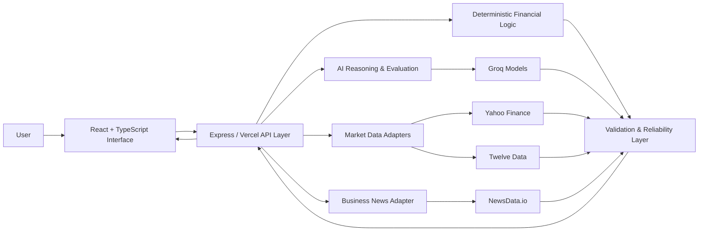

<div align="center">

# ArthaBench Pro

### Financial AI Reliability, Learning & Market Intelligence Platform

**AI-assisted financial reasoning • deterministic calculations • market intelligence • learning workflows • reliability-focused design**


</div>

---

## Overview

**ArthaBench Pro** is an educational and research-focused financial intelligence platform designed to make AI-assisted financial analysis more transparent, structured, and reliability-aware.

The platform combines:

- **AI-assisted financial reasoning** with dual Groq-based evaluation workflows
- **Deterministic financial calculations** for numerical consistency
- **Indian and global market intelligence** through server-side provider adapters
- **Business and financial news** through NewsData.io
- **Learning and evaluation workspaces** for finance-focused exploration
- **Safety and reliability controls** that distinguish live, delayed, unavailable, and demo data
- **Server-side secret handling** so provider credentials are not exposed to the browser

> ArthaBench Pro is an educational and research system. It does **not** provide personalized investment, tax, legal, or accounting advice.

---

## Why ArthaBench Pro?

Financial AI systems can produce fluent answers even when underlying data is stale, incomplete, or inconsistent. ArthaBench Pro is being built around a different principle:

> **Financial intelligence should be explainable, traceable, and explicit about data quality.**

Instead of relying only on an LLM, the platform separates financial calculations, provider data, AI reasoning, and reliability signals into distinct layers.

---

## Core Capabilities

### Market Intelligence
- India-focused market views
- U.S. and global market context
- Market-performance visualizations
- Provider freshness and fallback handling
- Server-side Yahoo Finance / Twelve Data adapters

### Ask Artha AI
- Finance-focused AI interaction
- Structured reasoning workflows
- Dual-model evaluation patterns using Groq
- Reliability-aware responses and educational safety controls

### Financial Learning
- Guided finance-learning workspace
- Concepts, comparisons, and structured exploration
- Educational framing rather than personalized financial advice

### Economic Intelligence
- Economic-rate and macroeconomic comparisons
- Market/economy context modules
- Data-driven visual analysis

### Business News
- NewsData.io-powered financial and business headlines
- Server-side API-key protection
- Explicit fallback behavior when live providers are unavailable

### Reliability & Evaluation
- Separation of deterministic calculations from AI explanations
- Provider diagnostics and health endpoints
- Explicit demo-data labelling
- Input/output validation using Zod

---

## Architecture



### Design principle

```text
External Data → Server-side Providers → Validation / Deterministic Logic
             → AI Reasoning → Reliability Signals → User Interface
```

Provider failure is not silently presented as live data. When a provider is unavailable, affected features are designed to surface the state clearly and may return explicitly labelled demo data.

---

## Technology Stack

| Layer | Technology |
|---|---|
| Frontend | React 19, TypeScript, Vite |
| Styling | Tailwind CSS 4 |
| Charts | Recharts |
| Motion / UI | Motion, Lucide React |
| Backend | Node.js, Express |
| Validation | Zod |
| Numerical precision | decimal.js |
| Testing | Vitest |
| Build | Vite + esbuild |
| Deployment | Vercel |
| AI Provider | Groq |
| News Provider | NewsData.io |
| Market Providers | Yahoo Finance adapter + Twelve Data fallback |

---

## Project Structure

```text
artha-bench-pro/
├── api/                 # Vercel serverless entry
├── docs/                # Provider and deployment documentation
├── server/              # Backend services and provider adapters
├── src/
│   ├── components/      # UI modules
│   │   ├── ai/
│   │   ├── dashboard/
│   │   ├── economy/
│   │   ├── evaluation/
│   │   ├── learning/
│   │   ├── market/
│   │   └── news/
│   ├── data/
│   ├── schemas/
│   └── services/
├── tests/               # Automated tests
├── server.ts            # Application server
├── vercel.json          # Vercel configuration
└── package.json
```

---

## Getting Started

### 1. Clone the repository

```bash
git clone https://github.com/shreyashsinghegi2-oss/artha-bench-pro.git
cd artha-bench-pro
```

### 2. Install dependencies

```bash
npm install
```

### 3. Configure environment variables

Create a local `.env` file using `.env.example` as the reference.

```env
GROQ_API_KEY=

BUSINESS_NEWS_PROVIDER=newsdata
BUSINESS_NEWS_API_KEY=
BUSINESS_NEWS_BASE_URL=https://newsdata.io/api/1/latest

MARKET_DATA_PROVIDER=twelvedata
MARKET_DATA_API_KEY=
MARKET_DATA_BASE_URL=https://api.twelvedata.com/quote

# Optional experimental no-key provider
# MARKET_DATA_PROVIDER=yahoo
# YAHOO_FINANCE_BASE_URL=https://query1.finance.yahoo.com/v8/finance/chart
```

**Security:** never prefix provider secrets with `VITE_`, commit `.env` files, or expose provider credentials in browser responses.

### 4. Run locally

```bash
npm run dev
```

### 5. Verify the project

```bash
npm run lint
npm test
npm run build
```

---

## Production Diagnostics

The production backend exposes health and diagnostics endpoints:

```text
GET /api/health
GET /api/diagnostics
```

These endpoints help verify application and provider connectivity after deployment.

---

## Market Data Strategy

ArthaBench Pro supports provider-based market-data retrieval with reliability-aware fallback behavior.

The repository includes documentation for:

- [Yahoo Finance setup](docs/yahoo-finance-setup.md)
- [Hybrid Yahoo → Twelve Data setup](docs/hybrid-market-data-setup.md)

The hybrid strategy allows Yahoo data to be attempted first while preserving paid/free-tier Twelve Data credits for fallback requests when required.

---

## Security & Reliability Principles

- API credentials remain server-side
- `.env` files are excluded from source control
- Responses distinguish live/provider data from demo fallback data
- Financial calculations can be performed independently from LLM-generated explanations
- Provider health can be inspected through diagnostics endpoints
- Schema validation is used at application boundaries

---

## Roadmap

ArthaBench Pro is under active development. Planned directions include:

- [ ] Retrieval-Augmented Generation (**RAG**) for financial documents
- [ ] Document-level citations and evidence tracing
- [ ] Larger financial knowledge corpus
- [ ] Improved market-data reliability scoring
- [ ] Expanded Indian and U.S. economic indicators
- [ ] Portfolio and company-analysis workflows
- [ ] Enhanced AI answer evaluation and confidence signals
- [ ] More automated tests and observability

### Planned Financial RAG Layer

```text
Financial PDFs / Reports / Regulations
        ↓
Document ingestion & cleaning
        ↓
Chunking + metadata
        ↓
Hybrid retrieval / vector search
        ↓
Reranking
        ↓
Artha AI reasoning
        ↓
Evidence-backed answer + citations
```

RAG is listed as a **roadmap feature**, not as a currently deployed capability.

---

## Development Commands

| Command | Purpose |
|---|---|
| `npm run dev` | Start development server |
| `npm run lint` | TypeScript type checking |
| `npm test` | Run Vitest test suite |
| `npm run build` | Build frontend + backend bundles |
| `npm start` | Start production Node server |

---

## Author

**Shreyash Singh**  
GitHub: [@shreyashsinghegi2-oss](https://github.com/shreyashsinghegi2-oss)

Building at the intersection of **AI, financial technology, data, and reliable decision-support systems**.

---

<div align="center">

### ArthaBench Pro
**Building more transparent and reliability-aware financial AI.**

</div>
