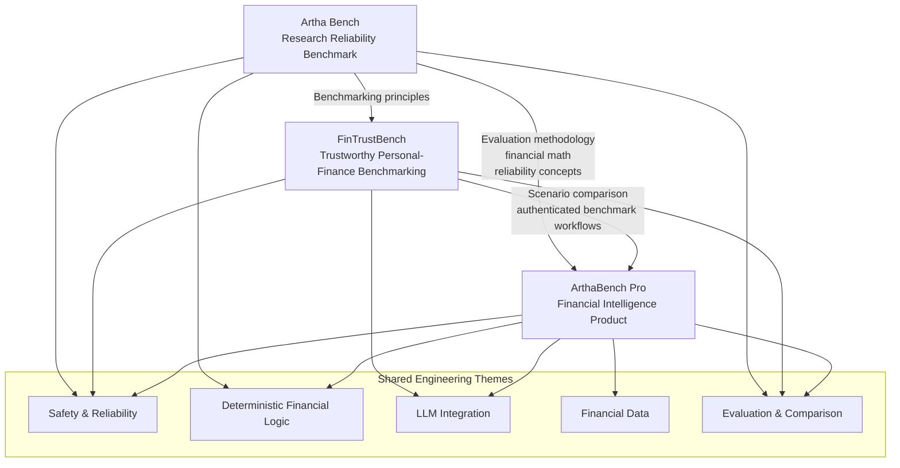
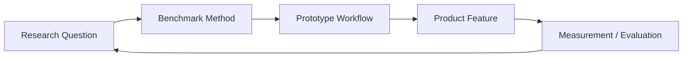
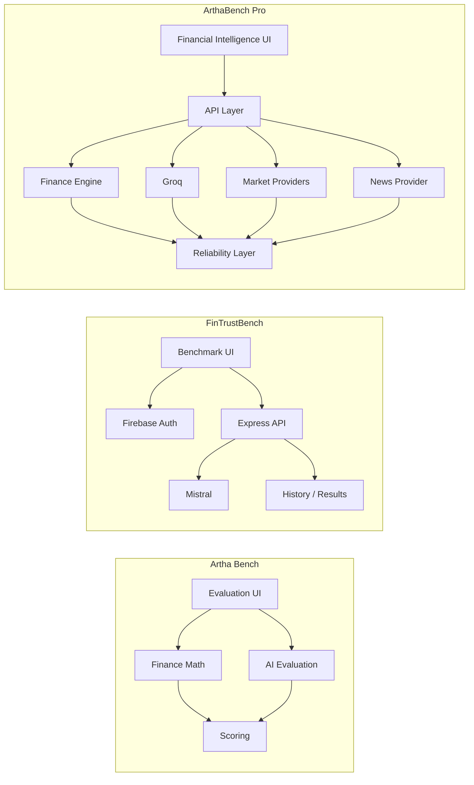
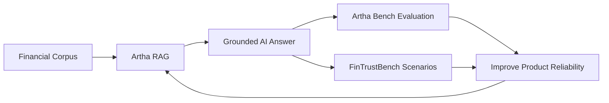

# Artha Project Ecosystem

This document explains how the three public financial-AI projects relate to each other without presenting them as the same product.

## Project roles

| Project | Primary Role | Core Strength |
|---|---|---|
| **Artha Bench** | Research benchmark | Financial-AI reliability evaluation and deterministic math |
| **FinTrustBench** | Benchmarking platform | Personal-finance scenarios, comparison, auth and structured AI evaluation |
| **ArthaBench Pro** | Flagship product | Market/news/economic intelligence, learning, AI reasoning and reliability-aware UX |

## Evolution model

The projects can therefore be understood as parts of one engineering/research loop:

1. **Artha Bench** explores how reliability can be measured.
2. **FinTrustBench** turns trustworthy-AI evaluation into richer user and comparison workflows.
3. **ArthaBench Pro** applies reliability-aware ideas inside a broader financial intelligence product.
4. Product observations can generate new benchmark questions and research directions.

## Architectural comparison

## Long-term direction

The strongest long-term architecture is not to merge every repository into one monolith. Instead, each repo can preserve a clear identity while sharing tested concepts, schemas, evaluation methods, or packages when those abstractions become stable enough to extract.

Potential future shared packages:

- financial formulas / deterministic math
- reliability scoring schemas
- benchmark scenario format
- provider-status / freshness types
- citation/evidence contracts
- common evaluation metrics

## Planned knowledge layer

ArthaBench Pro's planned financial-document RAG can eventually create a new feedback path into the research projects:

This keeps the product, benchmark, and trust-testing layers connected while retaining clear responsibilities.
