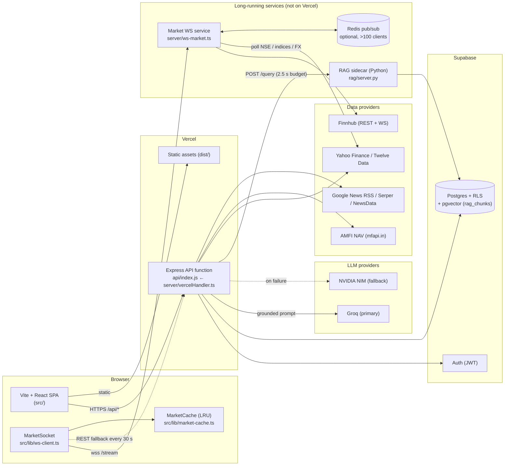

# ArthaBench Pro — System Design

Status: reflects the code in this repository as of 2026-09-28. Where something is designed but not yet deployed, it says so.

> **Stack note.** ArthaBench Pro is **not** a Next.js app. The front end is a Vite + React SPA; the API is one Express app (`server.ts` locally, bundled from `server/vercelHandler.ts` into `api/index.js` for Vercel). Paths in this document are the real ones (`src/lib/…`, `server/…`), not `app/` or `pages/`.

---

## 1. Architecture



### Request path: an AI question

```
user question
  → POST /api/ai/*            (rate limiter → optional Supabase JWT check)
  → gatherLiveContext()       (server/liveGrounding.ts, all in parallel, each with a timeout)
       ├─ market quotes          (marketDataService)
       ├─ news / web search      (Serper if keyed → Google News RSS)
       ├─ official documents     (RagEngine → rag sidecar, hybrid search, top 5, only if RAG_SIDECAR_URL is set)
       └─ deterministic numbers  (src/services/calculators.ts, indiaTaxEngine.ts)
  → groundSystemPrompt()      (live facts + numbered citations injected into the system prompt)
  → Groq  ──fail──▶ NVIDIA NIM ──fail──▶ local template fallback (live facts shown verbatim, no AI)
  → schema validation (zod) → response with sources[]
```

### Request path: a live price

```
browser MarketSocket ── subscribe {symbols ≤ 50} ──▶ ws-market (hub)
                                                     ├─ refcount++ per symbol; first watcher starts upstream
                                                     ├─ Finnhub WS for US tickers / EXCH:SYM
                                                     └─ REST polling (15 s) for .NS/.BO, ^indices, FX, futures
upstream tick ─▶ hub.cache (last tick) ─▶ per-client SymbolThrottle (≤1 msg/s/symbol, latest wins) ─▶ browser
browser: parseServerMessage (validate) ─▶ MarketCache.push (ring of 1,000/symbol, LRU across symbols)
```

---

## 2. Why each choice

### pgvector (in Supabase) vs Pinecone
- **Already paid for and already trusted.** Supabase Postgres already holds user data under RLS. One more table avoids a second vendor, a second bill and a second place where data governance has to be argued.
- **Hybrid search in one query.** `rag_hybrid_search()` does HNSW cosine search and `tsvector` full-text search, then fuses them with Reciprocal Rank Fusion in SQL. Pinecone would need a separate keyword index, or its sparse vectors, plus fusion in application code.
- **Corpus size.** SEBI, RBI, CBDT, AMFI and NSE/BSE circulars come to thousands to low hundreds of thousands of chunks. HNSW in Postgres handles that comfortably. Pinecone's advantages show up at hundreds of millions of vectors, a scale this product does not have.
- **Cost of the choice.** Vector search now shares CPU and RAM with transactional queries. The mitigation is in §4: a read replica, or moving `rag_chunks` to its own instance, and the table is self-contained, so that move is cheap.

### Groq (primary) vs OpenAI
- **Latency.** Answers are grounded with 5–15 live facts plus retrieved documents, so prompts are long. Groq's LPU inference returns long-prompt completions fast, which matters when the user is waiting on a chat.
- **Cost and open weights.** Open-weight models (Llama family) keep per-token cost low and avoid lock-in: the same prompts run on NVIDIA NIM, the configured fallback in `server/aiGateway.ts`.
- **Multi-provider by design.** The gateway tries Groq, then NVIDIA, then a deterministic template that shows the live facts with no AI interpretation. No single vendor outage takes answers fully down.
- **Not claimed.** This document does **not** claim Groq offers Indian data residency. Prompts leave India. That is why §6 minimises what goes into them.
- **Embeddings.** These are not sent to an LLM vendor at all. The RAG sidecar uses an open-source model (`nomic-embed-text-v1.5`, 768 dimensions) when installed, or a deterministic hashing embedder when not.

### WebSocket vs Server-Sent Events
- **Bidirectional control.** Clients change their watch list constantly (subscribe/unsubscribe, up to 50 symbols) and send heartbeats. With SSE, every change would need a separate HTTP call plus server-side session correlation.
- **Per-client throttling needs identity.** The server keeps a `SymbolThrottle` and `WindowLimiter` per socket. That is natural with a persistent WebSocket.
- **What SSE would have been better at.** Automatic reconnect and passing through strict corporate proxies. The client makes up for the first with exponential backoff (0.5 s → 30 s, ±20% jitter) and for the second with the REST fallback every 30 s.

### Deterministic calculators, not the LLM, for numbers
- EMI, CAGR, XIRR, SIP future value and income tax are computed in TypeScript (`src/services/calculators.ts`, `portfolio.ts`, `indiaTaxEngine.ts`) with `Decimal` where rounding matters. The results are passed to the model as "numbers verified by the app — use exactly".
- LLMs make arithmetic slips and cannot be unit-tested. The calculators have hundreds of edge-case tests (`tests/calculators.edge.test.ts`, `tests/taxEngine.edge.test.ts`) and are checked against independent reference implementations.

### Vercel (API) + a separate WebSocket service
- Vercel serverless functions are request/response with a maximum duration (60 s here). They cannot hold thousands of idle sockets. The market stream therefore runs as a normal long-lived Node process (`npm run build:ws`, `server/ws.Dockerfile`) on any container host (Railway, Fly.io, Render, or a small VM).
- Everything stateless stays on Vercel, with global CDN, zero-ops deploys and preview URLs per branch.
- The Python RAG sidecar is separate for the same reason: model weights and warm process state don't fit a cold-starting function. It is also optional: without `RAG_SIDECAR_URL` the API behaves exactly as before.

---

## 3. Trade-offs

| Decision | Chosen | Alternative | What we gain | What we give up |
|---|---|---|---|---|
| Vector store | pgvector in Supabase | Pinecone / Weaviate | One DB, RLS, SQL hybrid search, no new vendor | Shares resources with OLTP; tuning HNSW is on us |
| Retrieval | Hybrid (HNSW + BM25/tsvector) + RRF + re-rank | Pure vector | Exact matches on circular numbers, section numbers ("80CCD(1B)") | Two indexes to maintain; more latency (~tens of ms) |
| Re-ranker | Cross-encoder when installed, lexical otherwise | Always cross-encoder | Works offline and in CI | Lower precision without the model |
| Embeddings | Open-source 768-dim, self-hosted | Vendor API | No per-call cost, no data leaves our infra | We host and version the model |
| LLM | Groq → NVIDIA NIM → template | Single vendor | Survives vendor outages | Behaviour differs slightly across models |
| Live prices | WebSocket service + REST fallback | Polling only | Sub-second US/crypto ticks, 1 msg/s cap | A second service to run and monitor |
| NSE data | REST polling (15 s) | Paid NSE WS feed | Free | Not tick-by-tick; labelled with its source |
| Fan-out | In-process hub; Redis only past 100 clients | Redis always | Zero dependencies at small scale | Two code paths (tested separately) |
| Numbers | Deterministic TS calculators | Ask the LLM | Testable and reproducible | Every new formula must be coded |
| Hosting | Vercel + container for WS/RAG | Everything on one VM | CDN, previews, zero-ops for 95% of traffic | Cross-service config (URLs, CORS, origins) |

---

## 4. Scalability

Assumptions, stated as assumptions rather than measurements: 20% of users are daily-active, 10% of daily-active users are online at peak, each online user watches 10 symbols, and a heavy user asks 10 AI questions a day.

| | **1K users** | **10K users** | **100K users** |
|---|---|---|---|
| Peak concurrent sockets | ~20 | ~200 | ~2,000 |
| WS topology | 1 standalone process | 1 ingest + 2 edge instances via Redis (`WS_ROLE`) | 1 ingest + 8–10 edges behind a TCP LB; shard ingest by symbol hash if upstream limits bite |
| Upstream connections | 1 Finnhub socket + pollers | same (ingest is the single upstream) | same, or 2–3 ingests by symbol shard |
| AI calls / day (heavy upper bound) | ~2,000 | ~20,000 | ~200,000; needs paid Groq tier, response caching for identical grounded prompts, queueing |
| RAG | sidecar, 1 instance | 2 instances + Supabase read replica | dedicated Postgres for `rag_chunks`; tune `hnsw.ef_search`; cache query embeddings |
| API (Vercel) | default | default | raise concurrency limits; move the in-memory rate limiter to Redis (see below) |
| DB | free/pro tier | pro + PgBouncer (Supavisor) | larger compute, read replicas, partition user history tables by month |

Known limits to fix before 10K:
- `server/rateLimiter.ts` is **in-memory per function instance**, so on Vercel it limits per warm instance, not globally. The upgrade is a Redis/Upstash token bucket keyed by user ID.
- `MarketHub` state is per process. That is why the Redis `edge`/`ingest` split exists; it needs a sticky or non-sticky TCP load balancer, since any edge can serve any client.

---

## 5. Failure modes

| Failure | Detection | Behaviour | User sees |
|---|---|---|---|
| Groq down / rate-limited | exception or non-2xx | fall back to NVIDIA NIM | answer, with `fallbackUsed: true` |
| All LLMs down | both fail | template answer: live facts + offline arithmetic, explicitly "not interpreted by AI" | a labelled offline answer |
| RAG sidecar down / slow | 2.5 s client timeout, 3 s grounding timeout | grounding continues without documents (`ok: false`) | answer without `[n]` document citations |
| pgvector cold (HNSW not in RAM) | p95 latency | first queries slower; same timeout applies | occasionally no document citations |
| Model hallucinates a citation | `extractCitations()` flags `[n]` outside 1..k | invalid IDs reported; UI can strip them | only valid citations |
| Market provider stale | provider timestamp | price shown with source and time; never re-labelled "live" | "as of HH:MM, source" |
| WS service down | client `onclose` | backoff 0.5 s → 30 s with jitter; REST poll every 30 s meanwhile | prices keep updating at 30 s |
| Half-open socket | missed pong (client 10 s; server 25 s ping) | client recycles the socket; server terminates it | brief reconnect |
| Tick flood | per-symbol throttle | coalesced to the latest price, ≤1 msg/s/symbol | smooth updates |
| Abusive client | `WindowLimiter` 30 msgs/10 s, 4 KB max frame, 50-symbol cap | error frames, then close on repeat | n/a |
| Redis down (edge mode) | ioredis reconnect | edges retry; interest re-announced every 30 s, TTL 90 s cleans up | brief gap; REST fallback covers |
| Finnhub socket drops | `onclose` | reconnect with backoff, resubscribe to all live symbols | brief gap |

---

## 6. Security model

- **Auth.** Supabase Auth issues JWTs. Personal-data routes verify the bearer token against Supabase (`/auth/v1/user`) on every request. The WS service can require the same token (`WS_REQUIRE_AUTH=1`, passed as `?token=` because browsers cannot set WS headers) and checks `Origin` against `WS_ALLOWED_ORIGINS`.
- **Row-Level Security.** Every user table has `auth.uid() = user_id` policies for all operations. RAG tables are read-only to `anon`/`authenticated`. Only the sidecar, using the service role, can write. `rag_hybrid_search` is `security invoker` with a pinned `search_path`.
- **Secrets.** Provider keys and `SUPABASE_SERVICE_ROLE_KEY` exist only in server environment variables and never ship in the Vite bundle; only `VITE_*` values are public, and those are anon keys by design. `/ingest` on the sidecar needs `RAG_ADMIN_TOKEN`, compared in constant time. Provider errors are sanitised (`Bearer …` redacted) before being logged or returned.
- **Input validation.** WS frames are parsed with a strict allow-list (`SYMBOL_RE`, 4 KB cap, ≤50 symbols). API bodies go through zod schemas. The web reader uses a safe URL fetch that blocks private network ranges.
- **Rate limiting.** Per-IP on the API (see the per-instance caveat above) and per-socket on WS.
- **Data minimisation for LLM calls.** Prompts carry the numbers needed for the answer, not identity documents. Uploaded PDFs are parsed in the browser for autofill where possible.
- **Session hygiene.** Automatic logout on inactivity and single-device sign-in.
- **Key rotation.** All keys are environment variables, so rotation is: issue a new key, update it in Vercel / the container host, redeploy, then revoke the old key. Nothing is hard-coded.

Gaps, stated plainly:
- There is **no** dedicated PII-masking layer in front of the LLMs yet. A name or PAN typed into chat is sent to the provider as typed. The next step is a server-side redactor for PAN, Aadhaar, account numbers and phone numbers before `runAiGateway`.
- No Content-Security-Policy header is set in `vercel.json` yet.
- The API rate limiter is not global (§4).
- No third-party security audit has been done. Nothing here is a guarantee.

---

## 7. Components added in this round

| Component | Path | Runs where | Required? |
|---|---|---|---|
| RAG indexer / retriever / server | `rag/*.py` | container (`rag/Dockerfile`) | optional: enable with `RAG_SIDECAR_URL` |
| pgvector schema + hybrid search | `supabase/migrations/20260928100000_rag_pgvector.sql` | Supabase | needed only for `PgVectorStore` |
| RAG client | `rag/rag_engine.ts` | Vercel API | yes (no-op when disabled) |
| WS market service | `server/ws-market.ts`, `server/ws/*` | container (`server/ws.Dockerfile`) | optional |
| WS client + cache | `src/lib/ws-client.ts`, `src/lib/market-cache.ts`, `src/lib/market-protocol.ts` | browser | not wired into UI yet (UI untouched by design) |
| CI | `.github/workflows/ci.yml` | GitHub Actions | yes |

Environment variables: `RAG_SIDECAR_URL`, `RAG_ADMIN_TOKEN`, `RAG_EMBEDDER` (`hashing` | `sentence-transformers`), `RAG_RERANKER`, `DATABASE_URL` (sidecar → pgvector), `WS_ROLE`, `REDIS_URL`, `WS_ALLOWED_ORIGINS`, `WS_REQUIRE_AUTH`, `WS_POLL_MS`, `FINNHUB_API_KEY`.

---

## 8. Precision engine (certified calculations)

`precision-engine/` is a FastAPI service that returns EMI, SIP, CAGR, XIRR, bond yield and income tax with a certificate.
The certificate gives a value, an interval proven to contain the true value of the stated formula, and an error bound.
If it cannot prove at most 1×10⁻⁸ relative error, it answers 422 with no number.

**Method**
- Inputs are decimal strings converted to exact rationals.
- EMI, SIP and tax are computed exactly.
- CAGR, XIRR and bond yield use outward-rounded interval arithmetic (mpmath `iv`) for existence, and Descartes' rule of signs or interval branch-and-bound for uniqueness.
- The proof is detailed in `precision-engine/README.md`.

**Evidence and speed**
- CI runs 10,000 Hypothesis cases per closed-form calculator and per tax regime, and 5,000 per root-finder, against oracles in a different library (Python `decimal` at 80 digits, `fractions`).
- Typical latency is 1–2 ms (EMI, SIP, CAGR, tax) to 7–100 ms (XIRR, depending on cash-flow count).

**Integration**
- Express proxies `/api/precision/*` when `PRECISION_ENGINE_URL` is set; `src/lib/precision-client.ts` is the browser client.
- The in-browser TypeScript calculators remain the default and are not yet switched over in the UI.
- `tests/integration/precisionParity.integration.test.ts` shows they match the certified values to the paisa (EMI, tax below the surcharge threshold), 1e-12 relative (CAGR) and 1e-7 (XIRR).

**Known differences from the TS tax engine**
- The precision engine rounds total income to ₹10 (s.288A).
- It applies surcharge marginal relief, which the TS engine only flags as a warning.

---

## 9. Fetch → Refine → Verify (live answers)

Every assistant answer is built from data fetched at question time. The model extracts, organises and explains that data with citations. Numbers the app can compute are computed by the app, never taken from the model.

```
question
  │
  ├─ FETCH (server/fetch/registry.ts; parallel, 4 s total budget, per-source timeout, cache, per-host back-off)
  │    rag        official documents in the RAG sidecar (when RAG_SIDECAR_URL is set)
  │    official   RBI and SEBI RSS feeds, only for RBI/SEBI questions; robots.txt respected, allowlisted hosts only
  │    market     quotes for named instruments (existing market-data service)
  │    fund       AMFI NAVs for a named fund (existing mutual-fund service)
  │    user-page  links in the question (safe reader; Firecrawl for JS pages only if FIRECRAWL_API_KEY is set)
  │    news       business headlines (existing news service)
  │    web        Google-first search (Serper → Tavily/Brave → keyless Google News); the first official result page is read
  │    wikipedia  plain concept questions only, used last, labelled "background"
  │
  ├─ REFINE INPUT (server/fetch/refineInput.ts)
  │    clean → deduplicate (text similarity ≥ 0.8 or same URL) → rank (official > market > news > web > background,
  │    plus question overlap and recency) → cap at ~6,000 characters → number [1..n] → wrap in <<<SOURCE n>>> blocks
  │
  ├─ VERIFY BEFORE (server/fetch/verifyNumbers.ts)
  │    EMI, SIP, CAGR and income-tax questions with all their inputs → computed by the precision engine
  │    (PRECISION_ENGINE_URL) or the app's calculators → passed to the model as "VERIFIED NUMBERS, copy exactly"
  │
  ├─ REFINE (Groq → NVIDIA NIM → offline template), with ANSWER RULES: cite [n] for every fact, say when the
  │    sources do not answer, never invent figures, prefer official sources, copy verified numbers exactly
  │
  └─ VERIFY AFTER (finalizeGroundedAnswer)
       citations: [n] that point at no source are removed and reported
       numbers:   a figure within 10% of a verified number but different is replaced; a missing one is stated at the top
       badge:     only precision-engine results with verification.all_agree === true
       sources:   numbered, with publisher, "as of" time, freshness and link, shown on the answer card
```

**Sources and their verified limits**

| Source | Key needed | Limits and terms (as checked) |
|---|---|---|
| RBI RSS (press releases, notifications) | No | Feed URLs published on rbi.org.in/Scripts/rss.aspx. Cached 15 min; robots.txt honoured; back-off on 403/429 |
| SEBI RSS | No | Feed URL published on sebi.gov.in/rss.html. Same rules |
| Google News RSS | No | Existing keyless fallback |
| Serper / Tavily / Brave | Yes | Existing, optional |
| Firecrawl | **Yes** | Its docs show every call needs `Authorization: Bearer fc-…`; there is no keyless mode. The Free plan has 1,000 credits a month, 1 credit per page. **Off** unless `FIRECRAWL_API_KEY` is set |
| Wikipedia REST | No | Concept questions only; labelled background |
| NSE / BSE | — | Not scraped. Prices come from the existing market-data service; NSE/BSE pages are read only when a search result links to them, through the robots-aware fetcher |
| data.gov.in | Yes | Not wired: it needs an API key and dataset-specific resources, with no general question-to-dataset mapping |

**Failure modes**
- A source times out or fails → it is dropped and the answer uses the rest.
- A host throttles (403/429) → back-off from 60 s, doubling to 15 min.
- robots.txt unreachable → that site is not read (RFC 9309).
- All models fail → the fetched facts are shown verbatim, labelled "not interpreted by AI".
- The precision engine is down → the app's calculator value is used, with no badge.

**Security**
- Fetched text is data: markers inside a page are neutralised so a page cannot close its own block, and the model is told to ignore instructions in sources.
- Official fetches use an allowlist, re-checked on every redirect.
- User links go through the private-network-blocking reader.
- No secrets appear in `/api/grounding/status`.

**Observability**
- `GET /api/grounding/status`: per-source runs, successes, failures, timeouts, cache hits, average latency and bytes.
- `GET /api/grounding/preview?q=`: runs the fetch and refine-input steps without calling a model (rate-limited).
- Each chat response includes `grounding` (sources, cited numbers, removed citations, number corrections).

**Evaluation**
- `scripts/eval-grounding.ts` covers 30 questions and reports citation coverage, unsupported figures, expected facts, fetch and answer latency p50/p95, and estimated tokens.
- Run it through the "Grounding evaluation" workflow before and after a deploy, then compare the two reports.
