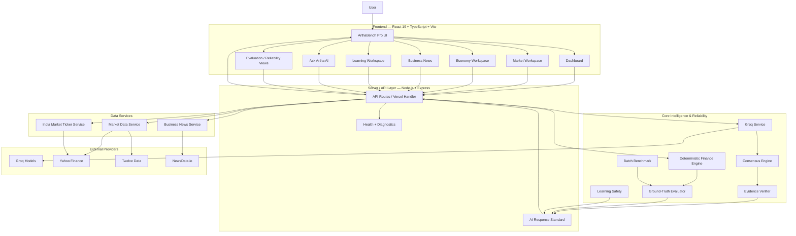
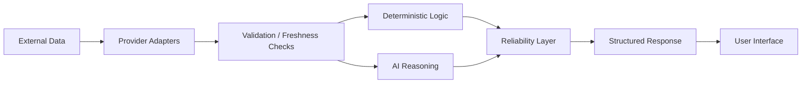
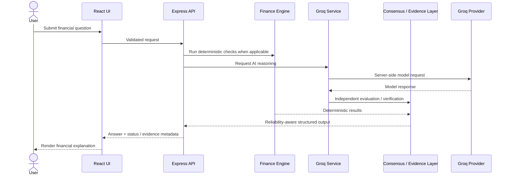
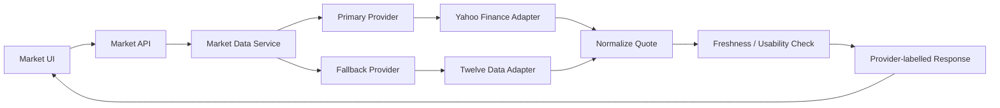
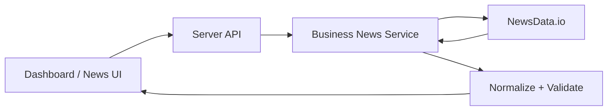
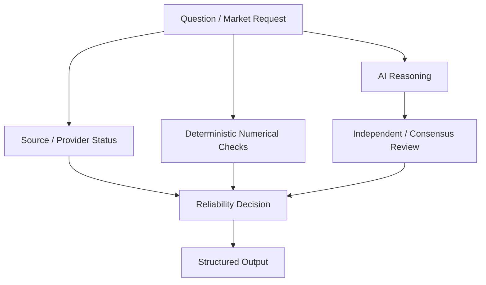
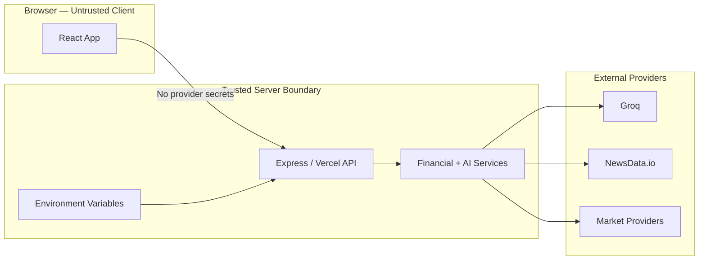
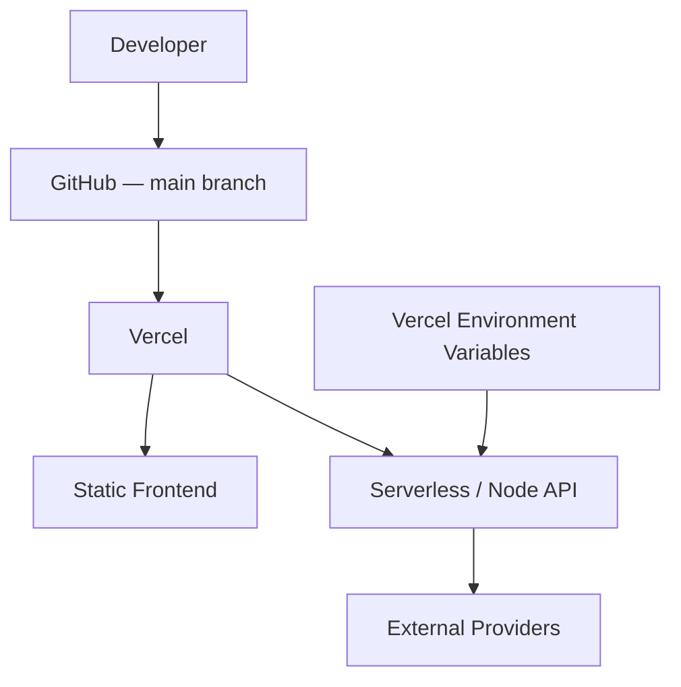
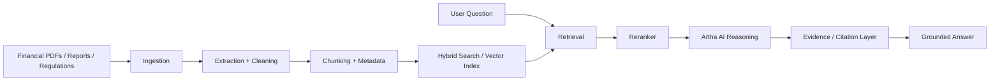

# ArthaBench Pro — Technical Wiki

> **Purpose:** A professional technical reference for the architecture, data flow, reliability model, security boundaries, modules, deployment, and roadmap of ArthaBench Pro.

## 1. System Overview

ArthaBench Pro is a financial AI reliability, learning, business-news, economic, and market-intelligence platform. Its architecture deliberately separates **live/provider data**, **deterministic financial logic**, **AI reasoning**, and **reliability controls** instead of allowing an LLM to become the source of truth for every operation.

### Architecture at a glance



---

## 2. Core Design Principle

ArthaBench Pro follows a **separation-of-trust** model:



The LLM can explain, compare, or reason, but deterministic calculations and provider states remain independently observable.

---

## 3. Major Modules

### Frontend

| Module | Responsibility |
|---|---|
| `src/components/dashboard/` | Main financial intelligence dashboard |
| `src/components/market/` | Market data, charts, ticker and performance views |
| `src/components/economy/` | Macroeconomic and rate-comparison views |
| `src/components/news/` | Financial/business news surfaces |
| `src/components/learning/` | Structured finance-learning workspace |
| `src/components/ai/` | Ask Artha AI experience |
| `src/components/evaluation/` | Reliability/evaluation UI |
| `src/services/` | Client-side service access to the API |
| `src/schemas/` | Frontend validation contracts |

### Server / Intelligence

| File / Module | Responsibility |
|---|---|
| `server/groqService.ts` | Server-side Groq model integration |
| `server/consensusEngine.ts` | Multi-model/independent evaluation logic |
| `server/financeEngine.ts` | Deterministic financial calculations |
| `server/evidenceVerifier.ts` | Evidence-oriented verification |
| `server/groundTruthEvaluator.ts` | Ground-truth and evaluation logic |
| `server/aiResponseStandard.ts` | Standardized AI response structure |
| `server/learningService.ts` | Learning-oriented AI flows |
| `server/learningSafety.ts` | Educational safety controls |
| `server/batchBenchmark.ts` | Batch evaluation / benchmark execution |
| `server/marketDataService.ts` | Market provider abstraction |
| `server/indiaMarketTickerService.ts` | India-market ticker retrieval |
| `server/businessNewsService.ts` | Business-news provider integration |

---

## 4. Ask Artha AI — Request Lifecycle



### Why this matters

A generated answer can be fluent and still be numerically wrong. By keeping deterministic computation separate from model reasoning, ArthaBench Pro can compare the two instead of trusting language generation blindly.

---

## 5. Market Data Architecture



The repository includes provider documentation for Yahoo Finance and a sequential Yahoo → Twelve Data fallback configuration. The fallback path is intended to avoid unnecessary paid/free-tier provider requests when the primary quote is usable.

---

## 6. Business News Flow



Provider credentials remain server-side. If the configured provider is unavailable, the application is designed to avoid silently presenting fallback/demo content as verified live data.

---

## 7. Reliability Model

ArthaBench Pro treats reliability as a **system property**, not a single confidence number.



### Reliability signals can include

- Provider availability
- Data freshness / trading-session context
- Deterministic calculation agreement
- Model agreement or disagreement
- Evidence availability
- Safety rules
- Explicit demo/fallback status

---

## 8. Security Boundary



### Security rules

- Provider secrets are stored only in server-side environment variables.
- Secrets must never use a browser-exposed `VITE_` prefix.
- `.env` files must never be committed.
- Browser responses must never echo provider credentials.
- Provider diagnostics should expose status, not secrets.

---

## 9. Deployment Architecture



### Verification commands

```bash
npm install
npm run lint
npm test
npm run build
```

Production diagnostics:

```text
GET /api/health
GET /api/diagnostics
```

---

## 10. Repository Structure

```text
artha-bench-pro/
├── api/                     # Vercel/serverless API entry
├── docs/                    # Architecture and provider documentation
├── server/                  # Backend intelligence + provider services
│   ├── financeEngine.ts
│   ├── groqService.ts
│   ├── consensusEngine.ts
│   ├── evidenceVerifier.ts
│   ├── groundTruthEvaluator.ts
│   ├── marketDataService.ts
│   ├── indiaMarketTickerService.ts
│   └── businessNewsService.ts
├── src/
│   ├── components/
│   │   ├── ai/
│   │   ├── dashboard/
│   │   ├── economy/
│   │   ├── evaluation/
│   │   ├── learning/
│   │   ├── market/
│   │   └── news/
│   ├── data/
│   ├── schemas/
│   └── services/
├── tests/
├── server.ts
└── vercel.json
```

---

## 11. Planned Financial RAG Architecture

> This section is a **roadmap design**, not a claim that RAG is already deployed.



Recommended metadata fields include company, ticker, document type, publication date, financial year, quarter, regulator, source, page number, and document ID.

---

## 12. Project Positioning

ArthaBench Pro is the **product-oriented flagship** in the Artha project family.

- **ArthaBench Pro:** financial intelligence + AI reliability + market/news/economic/learning product
- **Artha Bench:** research-oriented financial AI reliability benchmark
- **FinTrustBench:** trustworthy personal-finance AI benchmarking and comparison platform

See [`PROJECT-ECOSYSTEM.md`](PROJECT-ECOSYSTEM.md) for the cross-project architecture.

---

## 13. Roadmap

- Financial-document RAG with source/page citations
- Larger verified financial corpus
- Stronger provider reliability scoring
- Expanded Indian and U.S. economic datasets
- Richer company and portfolio analysis
- More automated tests and observability
- Reproducible benchmark/evaluation reports

---

## 14. Engineering Philosophy

> **Do not hide uncertainty behind a polished AI answer.**

ArthaBench Pro aims to expose the difference between a calculation, a provider observation, an AI inference, and a fallback state so users and evaluators can understand what the system actually knows.
